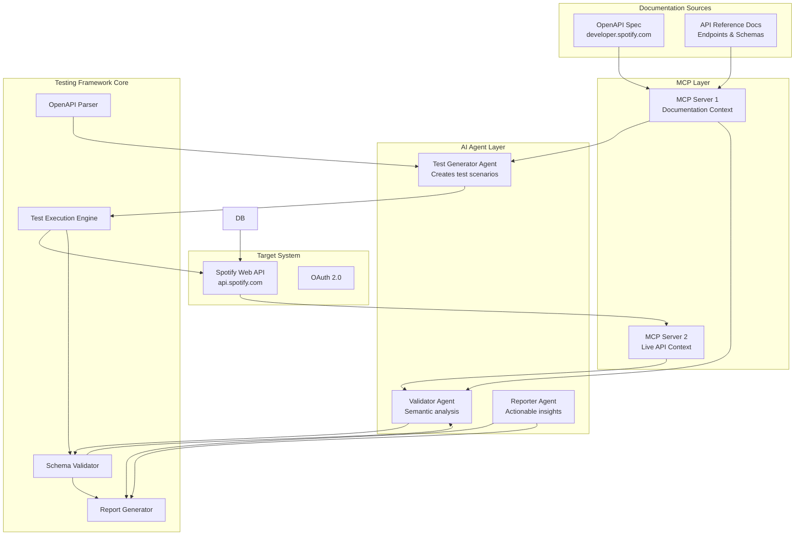
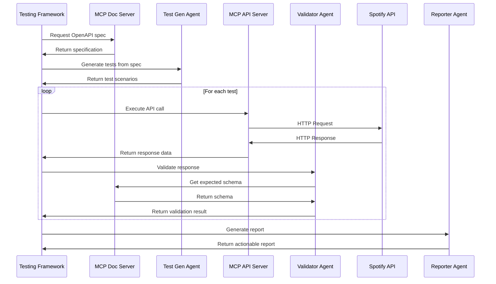

# Documentation Testing Framework Architecture

## Overview

An AI-powered framework that validates API documentation against live systems using MCP (Model Context Protocol) for intelligent context sharing and AI agents for semantic analysis.

## Target System Analysis

**Target API: Spotify Web API**
- **Technology**: RESTful API with OAuth 2.0
- **OpenAPI Support**: Available at developer.spotify.com
- **Endpoints**: 150+ REST endpoints (Tracks, Playlists, Albums, Artists, Search, etc.)
- **Documentation**: Comprehensive API reference at developer.spotify.com
- **Base URL**: `https://api.spotify.com/v1`

## System Architecture



## Component Design

### 1. MCP Servers

#### MCP Server 1: Documentation Context Provider
**Purpose**: Expose structured API documentation as context

**Capabilities**:
- Parse OpenAPI/Swagger specifications
- Extract endpoint definitions, schemas, examples
- Provide contract information (request/response formats)
- Expose documentation metadata

**Tools Exposed**:
- `get_openapi_spec`: Retrieve full OpenAPI specification
- `get_endpoint_details`: Get specific endpoint documentation
- `get_schema_definition`: Retrieve schema definitions
- `list_endpoints`: List all documented endpoints

#### MCP Server 2: Live API Context Provider
**Purpose**: Expose runtime API behavior and responses

**Capabilities**:
- Execute API calls and capture responses
- Monitor response times and status codes
- Track actual data schemas
- Capture error responses

**Tools Exposed**:
- `execute_api_call`: Make live API requests
- `get_response_schema`: Extract actual response structure
- `check_endpoint_availability`: Verify endpoint accessibility
- `get_api_metrics`: Retrieve performance metrics

### 2. AI Agents

#### Test Generator Agent
**Responsibilities**:
- Analyze OpenAPI specifications via MCP
- Generate comprehensive test scenarios
- Create edge case tests
- Generate test data variations

**Intelligence**:
- Understands REST semantics
- Identifies implicit requirements
- Generates boundary value tests
- Creates negative test cases

#### Validator Agent
**Responsibilities**:
- Compare documented vs actual behavior
- Perform semantic schema validation
- Identify discrepancies
- Classify severity of issues

**Intelligence**:
- Semantic understanding of data types
- Context-aware validation
- Tolerance for acceptable variations
- Pattern recognition for common issues

#### Reporter Agent
**Responsibilities**:
- Analyze validation results
- Generate actionable reports
- Suggest documentation fixes
- Prioritize issues

**Intelligence**:
- Root cause analysis
- Impact assessment
- Fix recommendation generation
- Documentation improvement suggestions

### 3. Core Framework Components

#### OpenAPI Parser
```java
class OpenAPIParser {
    - parseSpecification(String specUrl)
    - extractEndpoints()
    - extractSchemas()
    - extractExamples()
}
```

#### Test Execution Engine
```java
class TestExecutionEngine {
    - executeTestSuite(TestSuite suite)
    - captureResponse(Request request)
    - validateResponse(Response response, Schema expected)
    - generateReport(ValidationResults results)
}
```

#### Schema Validator
```java
class SchemaValidator {
    - validateSchema(Object actual, Schema documented)
    - compareTypes(Type actual, Type expected)
    - validateConstraints(Object value, Constraints constraints)
    - detectSemanticDifferences(Object actual, Object expected)
}
```

## Data Flow

### Validation Workflow



## Technology Stack

### Core Framework
- **Language**: Java 21
- **Framework**: Spring Boot 3.x
- **Testing**: JUnit 5, RestAssured
- **Build**: Maven

### Dependencies
- **OpenAPI**: Swagger Parser 2.x
- **HTTP Client**: RestAssured, OkHttp
- **JSON Processing**: Jackson
- **Schema Validation**: JSON Schema Validator
- **MCP SDK**: Java MCP SDK
- **AI Integration**: OpenAI API / Anthropic Claude API

### MCP Servers
- **Language**: Java/TypeScript (flexible)
- **Protocol**: MCP (Model Context Protocol)
- **Transport**: stdio/HTTP

## Configuration

### Framework Configuration
```yaml
doc-validator:
  target-api:
    base-url: http://localhost:8080
    openapi-spec: http://localhost:8080/openapi
  mcp:
    doc-server:
      command: node
      args: [dist/doc-server.js]
    api-server:
      command: node
      args: [dist/api-server.js]
  ai:
    provider: openai
    model: gpt-4
    temperature: 0.2
  validation:
    strict-mode: false
    semantic-analysis: true
    generate-fixes: true
```

## Key Features

### 1. Intelligent Test Generation
- AI analyzes OpenAPI specs to create comprehensive test suites
- Generates edge cases and boundary conditions
- Creates realistic test data

### 2. Semantic Validation
- Goes beyond syntax checking
- Understands intent and context
- Identifies logical inconsistencies

### 3. MCP-Powered Context Sharing
- Efficient context management
- Real-time API behavior monitoring
- Structured documentation access

### 4. Actionable Reporting
- Clear identification of issues
- Specific fix recommendations
- Prioritized action items
- Documentation patches

## Example Use Cases

### Use Case 1: Endpoint Validation
**Scenario**: Validate `/v1/tracks/{id}` endpoint

**Process**:
1. MCP Doc Server provides endpoint documentation
2. Test Generator Agent creates test cases
3. Test Engine executes against live API
4. Validator Agent compares results
5. Reporter Agent generates findings

**Expected Output**:
```
✓ Endpoint accessible
✓ Response schema matches documentation
✗ Error response format differs from documented
  - Documented: 404 Not Found
  - Actual: 400 Bad Request for invalid ID format
  Recommendation: Update OpenAPI spec to document 400 status code
```

### Use Case 2: Schema Drift Detection
**Scenario**: Detect when API responses diverge from documentation

**Process**:
1. Continuous monitoring via MCP API Server
2. Schema comparison on each response
3. AI identifies semantic differences
4. Report generated with impact analysis

## Benefits

1. **Continuous Quality**: Automated validation in CI/CD
2. **Developer Productivity**: Accurate documentation reduces confusion
3. **Agent Reliability**: AI agents get correct context
4. **Proactive Maintenance**: Issues detected before they impact users
5. **Documentation as Code**: Testable, version-controlled documentation

## Next Steps

1. Set up Maven project structure
2. Implement MCP servers
3. Integrate AI agents
4. Build core validation engine
5. Create example validation suite for Spotify API
6. Document usage and best practices