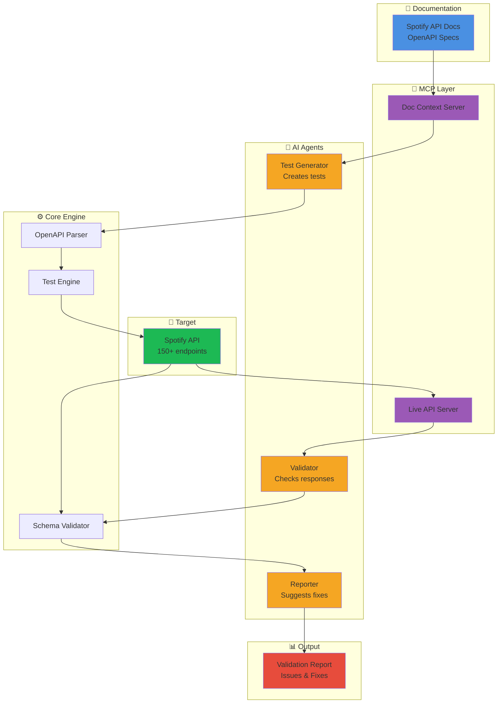

# DocValidator - Quick Reference Guide

## 📍 Project Location
```
/Users/viku/Dev_Projects/Java_Projects/tut_java/tut03
```

---

## 📚 Documentation Files

```
tut03/
├── README.md                      # Main project overview & quick start
├── PROJECT_SUMMARY.md             # Executive summary with full details
├── ARCHITECTURE.md                # System architecture & components
├── SPOTIFY_ARCHITECTURE.md        # Spotify API demo architecture
├── SPOTIFY_EXAMPLE.md             # Complete Spotify validation example
├── TEST_GENERATION_STRATEGY.md    # Test generation methodology
├── HOW_IT_WORKS.md                # Simple explanation
├── UI_DESIGN.md                   # Web UI design (6 screens)
├── PROJECT_STRUCTURE.md           # Project organization
└── QUICK_REFERENCE.md             # This file
```

---

## 🎯 What is DocValidator?

**One-Line Summary**: AI-powered tool that checks if API documentation matches reality

**Problem**: API docs get outdated → developers waste time debugging

**Solution**: Automatically test docs against live APIs and report what's wrong

---

## 🏗️ System Architecture Diagram



---

## 🔄 How It Works (Simple Flow)

```
Step 1: Read Documentation
   ↓
   📖 DocValidator reads Spotify's API docs
   
Step 2: AI Generates Tests
   ↓
   🤖 AI creates 100+ test scenarios automatically
   
Step 3: Run Tests
   ↓
   ⚡ Tests execute against live Spotify API
   
Step 4: Compare Results
   ↓
   🔍 Compare actual responses vs documented behavior
   
Step 5: Generate Report
   ↓
   📊 Report shows what's wrong + how to fix it
```

---

## 🎨 Web UI Screens

```
┌─────────────────────────────────────────┐
│  1. Dashboard                            │
│     - Statistics (tests passed/failed)  │
│     - Recent validations                │
│     - Quick actions                     │
└─────────────────────────────────────────┘

┌─────────────────────────────────────────┐
│  2. Configuration                        │
│     - Spotify API credentials           │
│     - AI settings (OpenAI/Claude)       │
│     - Test connection                   │
└─────────────────────────────────────────┘

┌─────────────────────────────────────────┐
│  3. Test Execution                       │
│     - Select endpoints to test          │
│     - Configure test options            │
│     - Start validation                  │
└─────────────────────────────────────────┘

┌─────────────────────────────────────────┐
│  4. Live Progress                        │
│     - Real-time test execution          │
│     - Progress bar                      │
│     - Live results streaming            │
└─────────────────────────────────────────┘

┌─────────────────────────────────────────┐
│  5. Results Viewer                       │
│     - Summary statistics                │
│     - Issues by severity                │
│     - Detailed findings                 │
└─────────────────────────────────────────┘

┌─────────────────────────────────────────┐
│  6. Issue Details                        │
│     - Problem description               │
│     - What docs say vs reality          │
│     - AI-generated fix                  │
└─────────────────────────────────────────┘
```

---

## 🎵 Spotify API Coverage

```
Tracks (25 endpoints)
├── GET /v1/tracks/{id}
├── GET /v1/tracks
├── GET /v1/tracks/{id}/audio-features
└── GET /v1/tracks/{id}/audio-analysis

Playlists (30 endpoints)
├── GET /v1/playlists/{id}
├── POST /v1/playlists
├── PUT /v1/playlists/{id}
└── DELETE /v1/playlists/{id}

Albums (20 endpoints)
├── GET /v1/albums/{id}
├── GET /v1/albums
└── GET /v1/albums/{id}/tracks

Artists (25 endpoints)
├── GET /v1/artists/{id}
├── GET /v1/artists/{id}/albums
└── GET /v1/artists/{id}/top-tracks

Search (10 endpoints)
├── GET /v1/search
└── (various query types)

User Profile (15 endpoints)
├── GET /v1/me
├── GET /v1/users/{id}
└── GET /v1/me/playlists

Player (25 endpoints)
├── GET /v1/me/player
├── PUT /v1/me/player/play
└── PUT /v1/me/player/pause

Total: 150+ endpoints
```

---

## 🛠️ Technology Stack

```
Backend
├── Spring Boot 3.x        (Framework)
├── Java 21                (Language)
├── JUnit 5                (Testing)
├── RestAssured            (API Testing)
├── Swagger Parser         (OpenAPI)
├── MCP SDK                (Context Protocol)
└── OpenAI/Claude SDK      (AI Integration)

Frontend
├── React 18               (UI Framework)
├── Material-UI            (Components)
├── Redux Toolkit          (State)
├── Axios                  (HTTP Client)
└── Recharts               (Charts)

Build & Deploy
├── Maven                  (Build)
├── Docker                 (Containerization)
└── GitHub Actions         (CI/CD)
```

---

## 📋 Implementation Checklist

### Phase 1: Setup ✅ (Planning Complete)
- [x] Design architecture
- [x] Create documentation
- [x] Design UI mockups
- [x] Plan Spotify integration

### Phase 2: Core Implementation (Next)
- [ ] Create Maven project
- [ ] Set up Spring Boot
- [ ] Add dependencies
- [ ] Create project structure

### Phase 3: Components
- [ ] OpenAPI Parser
- [ ] Test Generator Agent
- [ ] Validator Agent
- [ ] Reporter Agent
- [ ] Test Execution Engine

### Phase 4: MCP Integration
- [ ] MCP Documentation Server
- [ ] MCP Live API Server
- [ ] Context management

### Phase 5: Web UI
- [ ] React setup
- [ ] Dashboard
- [ ] Configuration screen
- [ ] Test execution screen
- [ ] Results viewer

### Phase 6: Spotify Integration
- [ ] OAuth 2.0 setup
- [ ] API client
- [ ] Test suite for 150+ endpoints
- [ ] Validation logic

### Phase 7: Testing & Polish
- [ ] Unit tests
- [ ] Integration tests
- [ ] Documentation
- [ ] Demo preparation

---

## 🚀 Quick Start Commands

```bash
# Navigate to project
cd /Users/viku/Dev_Projects/Java_Projects/tut_java/tut03

# View documentation
cat README.md
cat SPOTIFY_ARCHITECTURE.md

# When implementation starts:
mvn clean install              # Build project
mvn spring-boot:run            # Run application
mvn test                       # Run tests
open http://localhost:8080     # Open UI
```

---

## 📊 Example Validation Report

```
═══════════════════════════════════════════
DOCVALIDATOR REPORT: Spotify Web API
═══════════════════════════════════════════

Tests Run: 150
Passed: 142 (94.7%)
Failed: 8 (5.3%)
Discrepancies: 12

───────────────────────────────────────────
CRITICAL ISSUES (1)
───────────────────────────────────────────
🔴 Undocumented Required Scope
   Endpoint: GET /v1/tracks/{id}
   Issue: preview_url requires undocumented scope
   Fix: Add scope requirement to docs

───────────────────────────────────────────
HIGH SEVERITY (2)
───────────────────────────────────────────
🟠 Wrong Error Status Code
   Endpoint: GET /v1/tracks/{id}
   Issue: Returns 400 instead of 404
   Fix: Update OpenAPI spec

🟠 Missing Error Schema
   Endpoint: GET /v1/tracks/{id}
   Issue: Error format not documented
   Fix: Add error schema

───────────────────────────────────────────
MEDIUM SEVERITY (6)
───────────────────────────────────────────
🟡 Undocumented Fields (7)
   Endpoint: GET /v1/tracks/{id}
   Issue: Response has 7 extra fields
   Fix: Update schema definition

[... more issues ...]

───────────────────────────────────────────
RECOMMENDATIONS
───────────────────────────────────────────
1. Update OpenAPI spec with missing fields
2. Clarify OAuth scope requirements
3. Fix error status code documentation
4. Add error response schemas
```

---

## 🎯 Key Features Summary

| Feature | Description |
|---------|-------------|
| **AI Test Generation** | Automatically creates 100+ tests from API docs |
| **MCP Integration** | Efficient context sharing between components |
| **Semantic Validation** | Understands intent, not just syntax |
| **Live Monitoring** | Real-time test execution with progress |
| **Actionable Reports** | Clear issues + specific fix recommendations |
| **Web UI** | User-friendly interface, no command line needed |
| **OAuth 2.0** | Full Spotify authentication support |
| **150+ Endpoints** | Comprehensive Spotify API coverage |

---

## 📞 Support & Resources

- **Documentation**: All files in `/tut03` directory
- **Main README**: [README.md](README.md)
- **Architecture**: [SPOTIFY_ARCHITECTURE.md](SPOTIFY_ARCHITECTURE.md)
- **UI Design**: [UI_DESIGN.md](UI_DESIGN.md)
- **Examples**: [SPOTIFY_EXAMPLE.md](SPOTIFY_EXAMPLE.md)

---

## 🎓 Learning Path

1. **Start Here**: [README.md](README.md) - Get overview
2. **Understand How**: [HOW_IT_WORKS.md](HOW_IT_WORKS.md) - Simple explanation
3. **See Example**: [SPOTIFY_EXAMPLE.md](SPOTIFY_EXAMPLE.md) - Real validation
4. **Deep Dive**: [SPOTIFY_ARCHITECTURE.md](SPOTIFY_ARCHITECTURE.md) - Full architecture
5. **UI Preview**: [UI_DESIGN.md](UI_DESIGN.md) - See the interface

---

**Last Updated**: May 8, 2024
**Status**: Planning Complete ✅ | Ready for Implementation
**Location**: `/Users/viku/Dev_Projects/Java_Projects/tut_java/tut03`