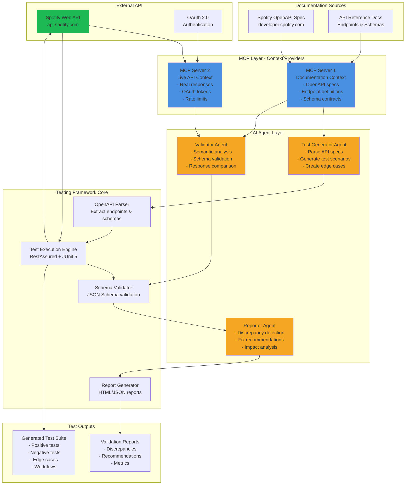
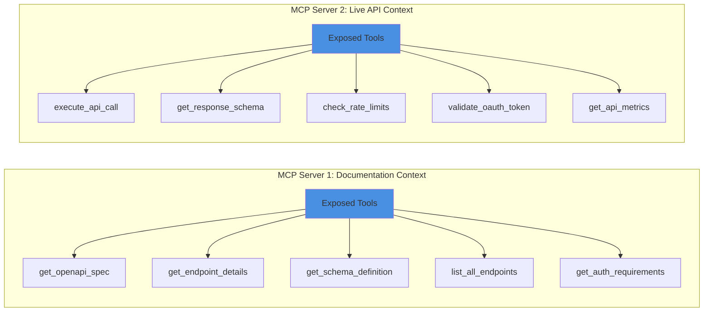
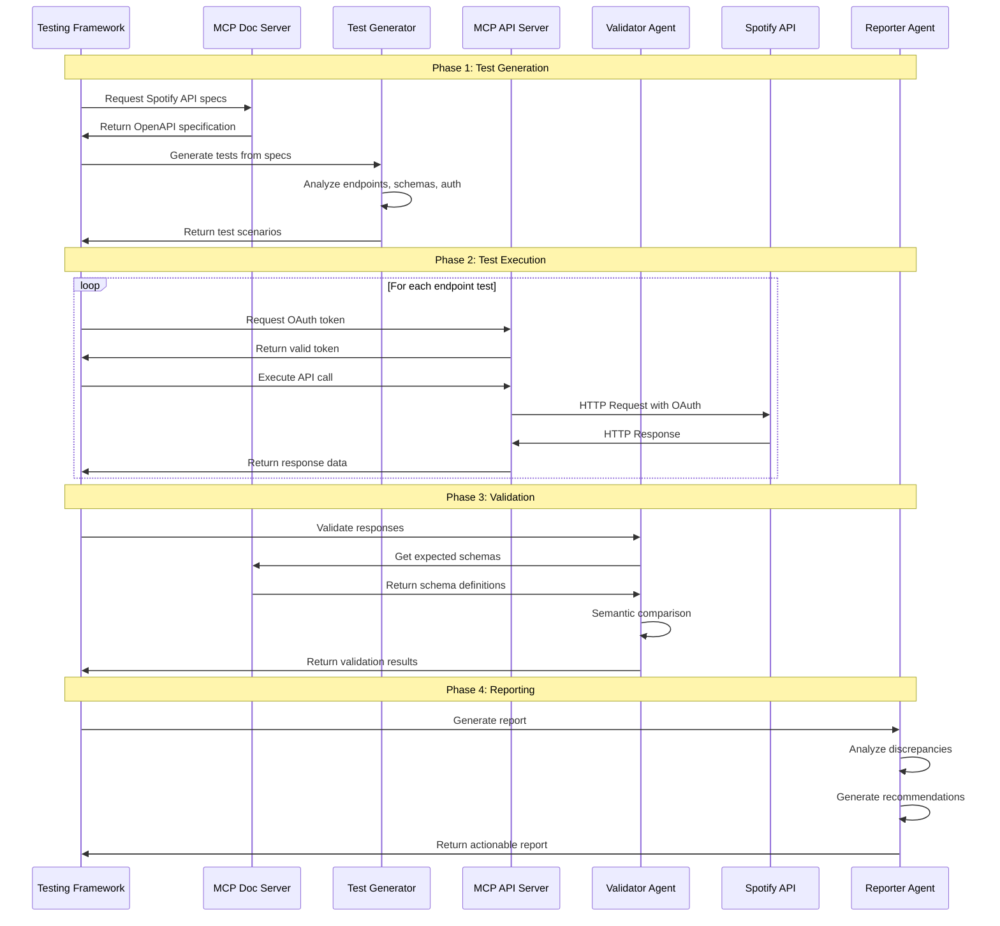
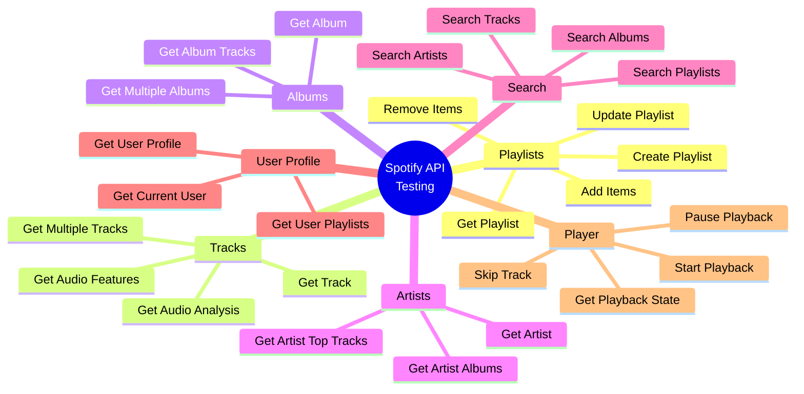
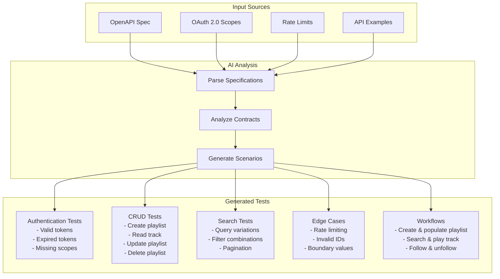
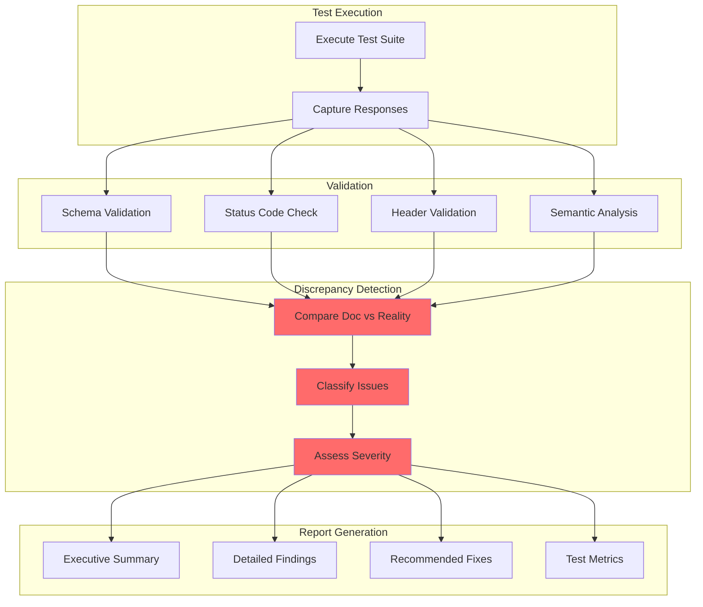
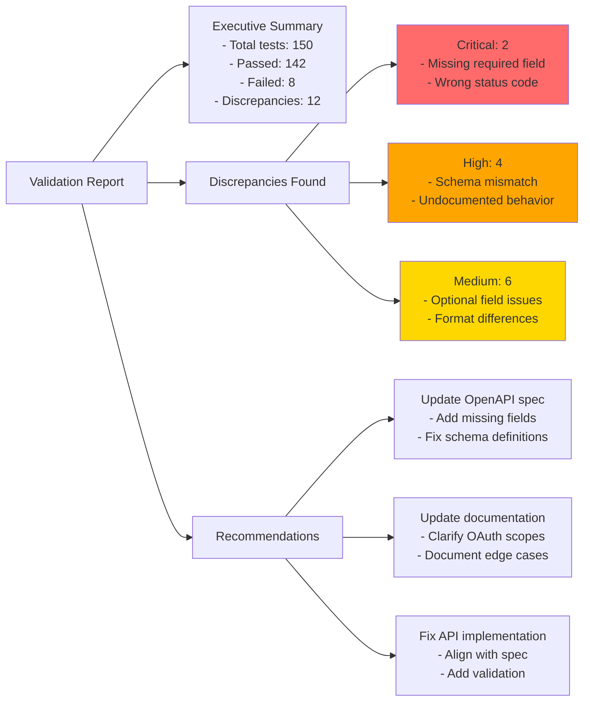
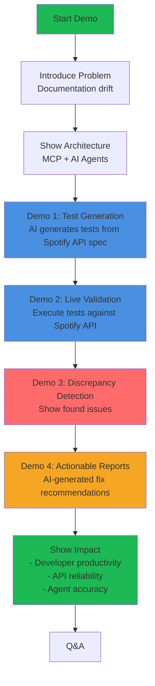
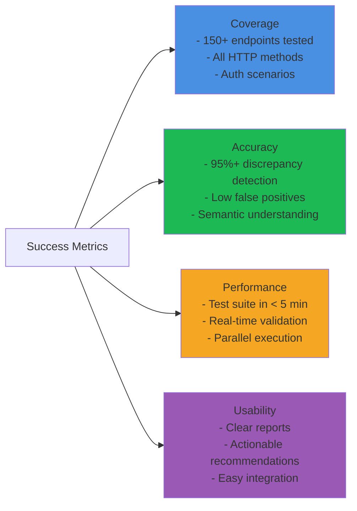

# Spotify API Documentation Testing Framework - Architecture

## Hackathon Demonstration: AI-Powered API Documentation Validation

This framework validates Spotify's API documentation against live responses, demonstrating how AI agents and MCP can ensure documentation accuracy for complex, real-world APIs.

---

## System Architecture Overview



---

## Detailed Component Architecture

### 1. MCP Servers - Context Management



### 2. AI Agent Workflow



---

## Spotify API Endpoints for Demonstration

### Endpoint Categories



### Example Test Scenarios

#### 1. Get Track Endpoint
```
Endpoint: GET /v1/tracks/{id}
Documentation: Returns track details including name, artists, album
Test Scenarios:
  ✓ Valid track ID returns 200 with complete schema
  ✓ Invalid track ID returns 404
  ✓ Response includes all documented fields
  ✓ Audio features link is valid
  ✗ DISCREPANCY: popularity field sometimes null (not documented)
```

#### 2. Search Endpoint
```
Endpoint: GET /v1/search
Documentation: Search for tracks, artists, albums, playlists
Test Scenarios:
  ✓ Query parameter required
  ✓ Type parameter accepts multiple values
  ✓ Limit parameter works (1-50)
  ✓ Offset parameter for pagination
  ✗ DISCREPANCY: Market parameter behavior differs from docs
```

#### 3. Create Playlist Endpoint
```
Endpoint: POST /v1/users/{user_id}/playlists
Documentation: Creates a playlist for a user
Test Scenarios:
  ✓ Valid OAuth token required
  ✓ Name field is required
  ✓ Public/private flags work
  ✓ Description is optional
  ✗ DISCREPANCY: Collaborative flag requires additional scope (not documented)
```

---

## Test Generation Strategy for Spotify API

### Contract-Based Test Generation



---

## Validation & Reporting Flow



---

## Example Validation Report Structure



---

## Technology Stack

### Core Framework
- **Language**: Java 21
- **Framework**: Spring Boot 3.x
- **Testing**: JUnit 5, RestAssured
- **Build Tool**: Maven

### Key Dependencies
```xml
<!-- API Testing -->
<dependency>
    <groupId>io.rest-assured</groupId>
    <artifactId>rest-assured</artifactId>
</dependency>

<!-- OpenAPI Parser -->
<dependency>
    <groupId>io.swagger.parser.v3</groupId>
    <artifactId>swagger-parser</artifactId>
</dependency>

<!-- OAuth 2.0 -->
<dependency>
    <groupId>org.springframework.security</groupId>
    <artifactId>spring-security-oauth2-client</artifactId>
</dependency>

<!-- JSON Schema Validation -->
<dependency>
    <groupId>com.networknt</groupId>
    <artifactId>json-schema-validator</artifactId>
</dependency>

<!-- MCP SDK -->
<dependency>
    <groupId>io.modelcontextprotocol</groupId>
    <artifactId>mcp-java-sdk</artifactId>
</dependency>

<!-- AI Integration -->
<dependency>
    <groupId>com.theokanning.openai-gpt3-java</groupId>
    <artifactId>service</artifactId>
</dependency>
```

---

## Hackathon Demo Flow



---

## Key Differentiators for Hackathon

1. **Real-World API**: Using Spotify's production API (not a toy example)
2. **AI-Powered**: Intelligent test generation and semantic validation
3. **MCP Integration**: Modern context protocol for efficient data sharing
4. **Actionable Insights**: Not just finding problems, but suggesting solutions
5. **Scalable**: Works with any OpenAPI-documented API
6. **Developer-Focused**: Solves real pain points in API development

---

## Success Metrics



---

## Future Enhancements

- **Auto-Fix**: Automatically generate documentation patches
- **Continuous Monitoring**: Real-time validation in CI/CD
- **Multi-API Support**: Test multiple APIs simultaneously
- **ML-Based Prediction**: Predict potential documentation issues
- **Integration Hub**: Connect with Postman, Swagger UI, etc.

---

This architecture demonstrates a production-ready solution for ensuring API documentation accuracy using cutting-edge AI and MCP technology, perfect for a hackathon showcase with Spotify's comprehensive API.