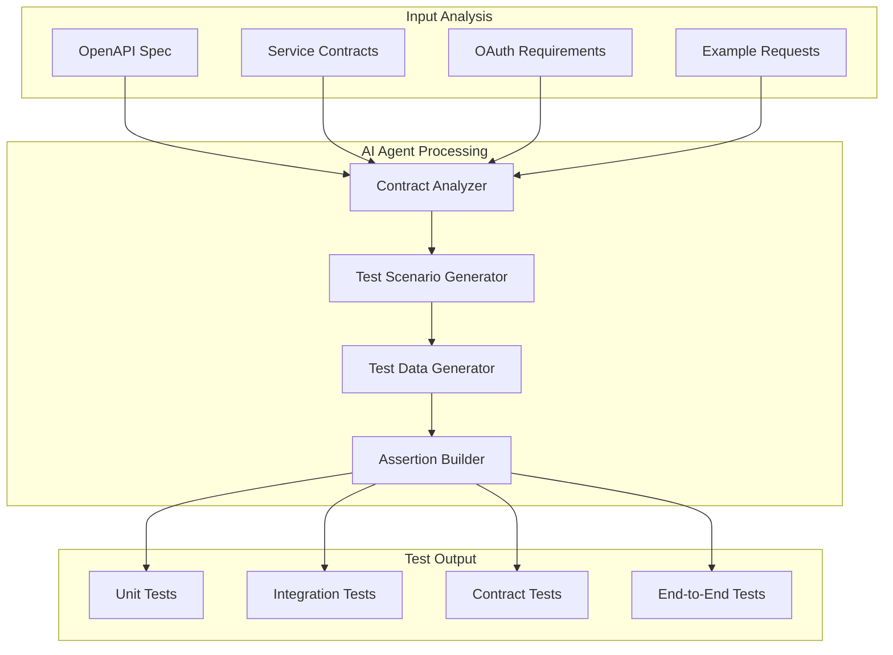
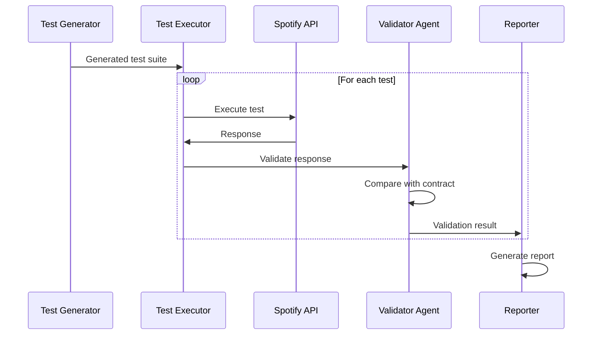

# Test Generation Strategy from API Specs and Service Contracts

## Overview

The framework uses **API specifications (OpenAPI/Swagger)** and **service contracts** as the primary sources for generating comprehensive, executable test cases. This document details how the AI agents transform documentation into actionable tests.

## Input Sources

### 1. OpenAPI/Swagger Specifications
Spotify's API exposes its OpenAPI spec at `https://developer.spotify.com/documentation/web-api`:

```yaml
openapi: 3.0.3
paths:
  /v1/tracks/{id}:
    get:
      summary: Get Track
      parameters:
        - name: id
          in: path
          required: true
          schema:
            type: string
      responses:
        '200':
          description: Success
          content:
            application/json:
              schema:
                $ref: '#/components/schemas/Track'
        '404':
          description: Track not found
```

### 2. Service Contracts
Contracts derived from:
- **API Documentation**: Endpoint definitions and expected behavior
- **Schema Definitions**: Request/response structures
- **Authentication Requirements**: OAuth 2.0 scopes and tokens
- **Rate Limiting**: API usage limits and throttling

## Test Generation Process



## Test Generation Strategies

### 1. Contract-Based Test Generation

#### From OpenAPI Specification

**Endpoint**: `GET /v1/tracks/{id}`

**Generated Tests**:
```java
@Test
@DisplayName("GET /v1/tracks/{id} - Should return track when ID exists")
void testGetTrack_Success() {
    // Generated from OpenAPI 200 response
    given()
        .header("Authorization", "Bearer " + token)
        .pathParam("id", "3n3Ppam7vgaVa1iaRUc9Lp")
    .when()
        .get("/v1/tracks/{id}")
    .then()
        .statusCode(200)
        .contentType(ContentType.JSON)
        .body("id", notNullValue())
        .body("name", notNullValue())
        .body("artists", notNullValue());
}

@Test
@DisplayName("GET /v1/tracks/{id} - Should return 404 when ID does not exist")
void testGetTrack_NotFound() {
    // Generated from OpenAPI 404 response
    given()
        .header("Authorization", "Bearer " + token)
        .pathParam("id", "invalid-track-id")
    .when()
        .get("/v1/tracks/{id}")
    .then()
        .statusCode(404);
}
```

#### From Service Contract

**Contract**: Create Playlist endpoint

**Generated Tests**:
```java
@Test
@DisplayName("POST /v1/playlists - Should create playlist with valid data")
void testCreatePlaylist_ValidData() {
    // Generated from service contract
    PlaylistRequest request = new PlaylistRequest(
        "My Awesome Playlist",  // Valid name
        "A collection of great songs",  // Description
        true  // Public
    );
    
    given()
        .header("Authorization", "Bearer " + token)
        .contentType(ContentType.JSON)
        .body(request)
    .when()
        .post("/v1/users/{user_id}/playlists")
    .then()
        .statusCode(201)
        .body("id", notNullValue())
        .body("name", equalTo("My Awesome Playlist"))
        .body("public", equalTo(true));
}

@Test
@DisplayName("POST /v1/playlists - Should reject empty name")
void testCreatePlaylist_EmptyName() {
    // Generated from validation rules
    PlaylistRequest request = new PlaylistRequest(
        "",  // Invalid: empty name
        "Description",
        true
    );
    
    given()
        .header("Authorization", "Bearer " + token)
        .contentType(ContentType.JSON)
        .body(request)
    .when()
        .post("/v1/users/{user_id}/playlists")
    .then()
        .statusCode(400);
}
```

### 2. Schema-Based Test Generation

**Schema Definition**:
```yaml
components:
  schemas:
    Track:
      type: object
      required:
        - id
        - name
        - artists
      properties:
        id:
          type: string
        name:
          type: string
        artists:
          type: array
          items:
            $ref: '#/components/schemas/Artist'
        duration_ms:
          type: integer
        popularity:
          type: integer
```

**Generated Schema Validation Tests**:
```java
@Test
@DisplayName("Schema Validation - Track response matches OpenAPI schema")
void testTrackSchema() {
    given()
        .header("Authorization", "Bearer " + token)
        .pathParam("id", "3n3Ppam7vgaVa1iaRUc9Lp")
    .when()
        .get("/v1/tracks/{id}")
    .then()
        .statusCode(200)
        .body(matchesJsonSchemaInClasspath("schemas/track-schema.json"));
}

@Test
@DisplayName("Schema Validation - All required fields present")
void testTrackRequiredFields() {
    given()
        .header("Authorization", "Bearer " + token)
        .pathParam("id", "3n3Ppam7vgaVa1iaRUc9Lp")
    .when()
        .get("/v1/tracks/{id}")
    .then()
        .statusCode(200)
        .body("$", hasKey("id"))
        .body("$", hasKey("name"))
        .body("$", hasKey("artists"));
}

@Test
@DisplayName("Schema Validation - Field types correct")
void testTrackFieldTypes() {
    given()
        .header("Authorization", "Bearer " + token)
        .pathParam("id", "3n3Ppam7vgaVa1iaRUc9Lp")
    .when()
        .get("/v1/tracks/{id}")
    .then()
        .statusCode(200)
        .body("id", instanceOf(String.class))
        .body("name", instanceOf(String.class))
        .body("duration_ms", instanceOf(Integer.class));
}
```

### 3. Workflow-Based Test Generation

**Documented Workflow**: Create and populate a playlist
1. Create playlist
2. Search for tracks
3. Add tracks to playlist
4. Verify playlist contents

**Generated Workflow Test**:
```java
@Test
@DisplayName("Complete Workflow - Create and populate playlist")
void testPlaylistWorkflow() {
    // Step 1: Create playlist
    String createResponse = given()
        .header("Authorization", "Bearer " + token)
        .contentType(ContentType.JSON)
        .body(new PlaylistRequest("Test Playlist", "Test", true))
    .when()
        .post("/v1/users/{user_id}/playlists")
    .then()
        .statusCode(201)
        .extract().asString();
    
    String playlistId = JsonPath.from(createResponse).getString("id");
    
    // Step 2: Search for tracks
    String searchResponse = given()
        .header("Authorization", "Bearer " + token)
        .queryParam("q", "Mr. Brightside")
        .queryParam("type", "track")
    .when()
        .get("/v1/search")
    .then()
        .statusCode(200)
        .extract().asString();
    
    String trackUri = JsonPath.from(searchResponse)
        .getString("tracks.items[0].uri");
    
    // Step 3: Add track to playlist
    given()
        .header("Authorization", "Bearer " + token)
        .contentType(ContentType.JSON)
        .body(Map.of("uris", List.of(trackUri)))
    .when()
        .post("/v1/playlists/{playlist_id}/tracks", playlistId)
    .then()
        .statusCode(201);
    
    // Step 4: Verify playlist contents
    given()
        .header("Authorization", "Bearer " + token)
    .when()
        .get("/v1/playlists/{playlist_id}/tracks", playlistId)
    .then()
        .statusCode(200)
        .body("items.size()", equalTo(1))
        .body("items[0].track.uri", equalTo(trackUri));
}
```

### 4. Edge Case and Boundary Test Generation

**AI Agent Analysis**:
- Analyzes data types and constraints
- Identifies boundary conditions
- Generates edge cases

**Generated Edge Case Tests**:
```java
@Test
@DisplayName("Edge Case - Very long playlist name")
void testCreatePlaylist_VeryLongName() {
    String longName = "A".repeat(1000);
    
    given()
        .header("Authorization", "Bearer " + token)
        .contentType(ContentType.JSON)
        .body(new PlaylistRequest(longName, "Test", true))
    .when()
        .post("/v1/users/{user_id}/playlists")
    .then()
        .statusCode(anyOf(is(201), is(400))); // Accept or reject
}

@Test
@DisplayName("Edge Case - Special characters in search query")
void testSearch_SpecialCharacters() {
    String specialQuery = "artist:\"The Killers\" track:\"Mr. Brightside\"";
    
    given()
        .header("Authorization", "Bearer " + token)
        .queryParam("q", specialQuery)
        .queryParam("type", "track")
    .when()
        .get("/v1/search")
    .then()
        .statusCode(200)
        .body("tracks.items", notNullValue());
}

@Test
@DisplayName("Edge Case - Maximum limit parameter")
void testSearch_MaxLimit() {
    given()
        .header("Authorization", "Bearer " + token)
        .queryParam("q", "rock")
        .queryParam("type", "track")
        .queryParam("limit", 50)  // Maximum allowed
    .when()
        .get("/v1/search")
    .then()
        .statusCode(200)
        .body("tracks.items.size()", lessThanOrEqualTo(50));
}
```

### 5. Negative Test Generation

**Generated from Contract Violations**:
```java
@Test
@DisplayName("Negative Test - Missing authentication")
void testMissingAuth() {
    given()
        // No Authorization header
        .pathParam("id", "3n3Ppam7vgaVa1iaRUc9Lp")
    .when()
        .get("/v1/tracks/{id}")
    .then()
        .statusCode(401);
}

@Test
@DisplayName("Negative Test - Invalid content type")
void testInvalidContentType() {
    given()
        .header("Authorization", "Bearer " + token)
        .contentType("text/plain")
        .body("Not JSON")
    .when()
        .post("/v1/users/{user_id}/playlists")
    .then()
        .statusCode(415); // Unsupported Media Type
}

@Test
@DisplayName("Negative Test - Expired token")
void testExpiredToken() {
    given()
        .header("Authorization", "Bearer expired_token")
        .pathParam("id", "3n3Ppam7vgaVa1iaRUc9Lp")
    .when()
        .get("/v1/tracks/{id}")
    .then()
        .statusCode(401);
}
```

## AI Agent Intelligence

### Contract Analyzer Agent
**Capabilities**:
- Parses OpenAPI specifications
- Extracts service contracts from documentation
- Identifies authentication requirements
- Maps relationships between entities

**Output**: Structured contract model

### Test Scenario Generator Agent
**Capabilities**:
- Generates positive test cases
- Creates negative test cases
- Identifies edge cases
- Designs workflow tests

**Intelligence**:
- Understands REST semantics
- Recognizes common patterns
- Applies testing best practices

### Test Data Generator Agent
**Capabilities**:
- Creates valid test data
- Generates boundary values
- Produces invalid data for negative tests
- Ensures data diversity

**Intelligence**:
- Respects data type constraints
- Generates realistic data
- Creates culturally diverse examples

### Assertion Builder Agent
**Capabilities**:
- Generates appropriate assertions
- Validates response schemas
- Checks status codes
- Verifies business logic

**Intelligence**:
- Context-aware assertions
- Comprehensive validation
- Clear failure messages

## Validation Against Live System

### Real-time Validation Process



### Discrepancy Detection

**Example Discrepancy**:
```
Test: GET /v1/tracks/{id} with invalid ID
Expected (from OpenAPI): 404 Not Found
Actual: 400 Bad Request

Analysis: Documentation says 404 but API returns 400 for invalid ID format
Severity: HIGH
Recommendation: Update OpenAPI spec to document 400 status for invalid IDs
```

## Benefits of Contract-Based Testing

1. **Comprehensive Coverage**: Tests generated from all documented contracts
2. **Consistency**: Tests match documentation exactly
3. **Maintainability**: Tests update when contracts change
4. **Documentation Quality**: Forces clear, complete specifications
5. **Regression Prevention**: Detects when implementation diverges from contract
6. **Developer Confidence**: Clear expectations for API behavior

## Integration with MCP

**MCP Server 1** provides:
- OpenAPI specifications
- Service contract definitions
- Authentication requirements
- Example data

**MCP Server 2** provides:
- Live API responses
- Actual behavior patterns
- Performance metrics
- Error patterns

**AI Agents** use both sources to:
- Generate comprehensive tests
- Validate actual vs expected
- Identify discrepancies
- Recommend fixes

## Summary

The framework treats **API specifications and service contracts as the source of truth** for test generation. By combining:
- OpenAPI/Swagger specifications
- Service contract definitions
- Authentication requirements
- AI-powered analysis

The system generates comprehensive, executable test suites that validate documentation accuracy against live system behavior, ensuring documentation remains a reliable source of truth for developers and AI agents.