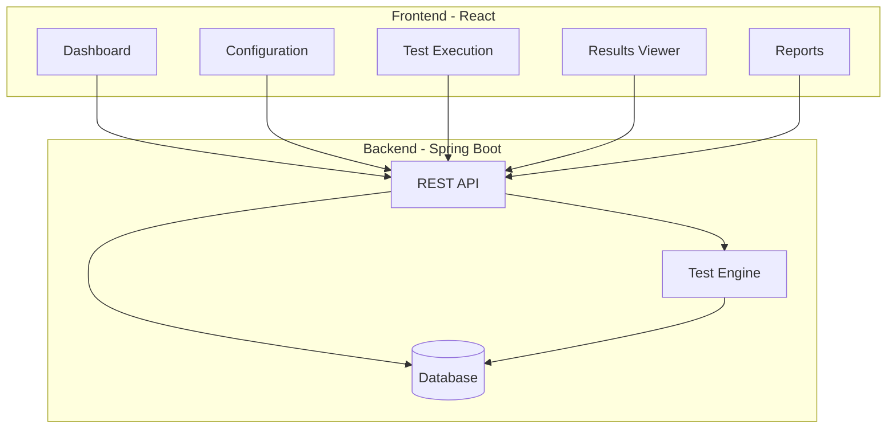

# DocValidator Web UI Design

## Overview

A modern, intuitive web interface for running API documentation validation tests against Spotify's API, viewing results, and managing validation workflows.

---

## UI Architecture



---

## Main Screens

### 1. Dashboard (Home Page)

```
┌─────────────────────────────────────────────────────────────┐
│  DocValidator                    [Settings] [Docs] [Logout]  │
├─────────────────────────────────────────────────────────────┤
│                                                               │
│  📊 Dashboard                                                │
│                                                               │
│  ┌──────────────┐  ┌──────────────┐  ┌──────────────┐      │
│  │   Tests Run  │  │    Passed    │  │    Failed    │      │
│  │     150      │  │     142      │  │      8       │      │
│  └──────────────┘  └──────────────┘  └──────────────┘      │
│                                                               │
│  Recent Validations                                          │
│  ┌─────────────────────────────────────────────────────┐    │
│  │ ✓ Spotify Tracks API      2 min ago    142/150     │    │
│  │ ✗ Spotify Playlists API   1 hour ago   85/100      │    │
│  │ ✓ Spotify Search API      3 hours ago  95/95       │    │
│  └─────────────────────────────────────────────────────┘    │
│                                                               │
│  Quick Actions                                               │
│  [▶ Run New Validation]  [📄 View Reports]  [⚙ Configure]  │
│                                                               │
└─────────────────────────────────────────────────────────────┘
```

### 2. Configuration Screen

```
┌─────────────────────────────────────────────────────────────┐
│  ⚙ Configuration                                             │
├─────────────────────────────────────────────────────────────┤
│                                                               │
│  Target API                                                  │
│  ┌─────────────────────────────────────────────────────┐    │
│  │ API Name:     [Spotify Web API            ▼]       │    │
│  │ Base URL:     [https://api.spotify.com/v1]         │    │
│  │ OpenAPI Spec: [https://developer.spotify.com/...]  │    │
│  └─────────────────────────────────────────────────────┘    │
│                                                               │
│  Authentication                                              │
│  ┌─────────────────────────────────────────────────────┐    │
│  │ Type:         [OAuth 2.0                  ▼]       │    │
│  │ Client ID:    [••••••••••••••••••••••••••]         │    │
│  │ Client Secret:[••••••••••••••••••••••••••]         │    │
│  │ [Test Connection]                                   │    │
│  │ Status: ✓ Connected                                │    │
│  └─────────────────────────────────────────────────────┘    │
│                                                               │
│  AI Configuration                                            │
│  ┌─────────────────────────────────────────────────────┐    │
│  │ Provider:     [OpenAI                     ▼]       │    │
│  │ Model:        [gpt-4                      ▼]       │    │
│  │ API Key:      [••••••••••••••••••••••••••]         │    │
│  └─────────────────────────────────────────────────────┘    │
│                                                               │
│  [Save Configuration]  [Reset to Defaults]                   │
│                                                               │
└─────────────────────────────────────────────────────────────┘
```

### 3. Test Execution Screen

```
┌─────────────────────────────────────────────────────────────┐
│  ▶ Run Validation                                            │
├─────────────────────────────────────────────────────────────┤
│                                                               │
│  Select Endpoints to Test                                    │
│  ┌─────────────────────────────────────────────────────┐    │
│  │ [✓] All Endpoints (150)                             │    │
│  │                                                       │    │
│  │ Tracks (25 endpoints)                                │    │
│  │   [✓] GET /v1/tracks/{id}                           │    │
│  │   [✓] GET /v1/tracks                                │    │
│  │   [✓] GET /v1/tracks/{id}/audio-features            │    │
│  │   [✓] GET /v1/tracks/{id}/audio-analysis            │    │
│  │                                                       │    │
│  │ Playlists (30 endpoints)                             │    │
│  │   [✓] GET /v1/playlists/{id}                        │    │
│  │   [✓] POST /v1/playlists                            │    │
│  │   [✓] PUT /v1/playlists/{id}                        │    │
│  │                                                       │    │
│  │ Search (10 endpoints)                                │    │
│  │   [✓] GET /v1/search                                │    │
│  │                                                       │    │
│  │ [Expand All] [Collapse All] [Select All]            │    │
│  └─────────────────────────────────────────────────────┘    │
│                                                               │
│  Test Options                                                │
│  ┌─────────────────────────────────────────────────────┐    │
│  │ [✓] Generate edge case tests                        │    │
│  │ [✓] Include negative tests                          │    │
│  │ [✓] Validate response schemas                       │    │
│  │ [✓] Check rate limiting                             │    │
│  │ [ ] Run in parallel (faster but uses more resources)│    │
│  └─────────────────────────────────────────────────────┘    │
│                                                               │
│  [▶ Start Validation]  [Cancel]                              │
│                                                               │
└─────────────────────────────────────────────────────────────┘
```

### 4. Live Execution View

```
┌─────────────────────────────────────────────────────────────┐
│  ⚡ Validation in Progress                                   │
├─────────────────────────────────────────────────────────────┤
│                                                               │
│  Progress: ████████████░░░░░░░░ 65% (98/150 tests)          │
│                                                               │
│  Current Test: GET /v1/playlists/{id}                        │
│  Status: Running...                                          │
│                                                               │
│  Live Results                                                │
│  ┌─────────────────────────────────────────────────────┐    │
│  │ ✓ GET /v1/tracks/{id}              200ms   PASSED   │    │
│  │ ✓ GET /v1/tracks                   150ms   PASSED   │    │
│  │ ✗ GET /v1/tracks/{id}/features     180ms   FAILED   │    │
│  │   └─ Discrepancy: Missing 'tempo' field             │    │
│  │ ✓ POST /v1/playlists               220ms   PASSED   │    │
│  │ ⚡ GET /v1/playlists/{id}          ...     RUNNING   │    │
│  │ ⏳ GET /v1/search                  ...     PENDING   │    │
│  │ ⏳ GET /v1/albums/{id}             ...     PENDING   │    │
│  └─────────────────────────────────────────────────────┘    │
│                                                               │
│  Statistics                                                  │
│  Passed: 95  Failed: 3  Running: 1  Pending: 51             │
│  Avg Response Time: 175ms                                    │
│  Estimated Time Remaining: 2 min 30 sec                      │
│                                                               │
│  [⏸ Pause]  [⏹ Stop]  [View Logs]                           │
│                                                               │
└─────────────────────────────────────────────────────────────┘
```

### 5. Results Viewer

```
┌─────────────────────────────────────────────────────────────┐
│  📊 Validation Results                                       │
├─────────────────────────────────────────────────────────────┤
│                                                               │
│  Spotify Web API - Validation Report                         │
│  Completed: May 8, 2024 08:39 UTC                           │
│  Duration: 3 min 45 sec                                      │
│                                                               │
│  Summary                                                     │
│  ┌──────────────┐  ┌──────────────┐  ┌──────────────┐      │
│  │   Passed     │  │    Failed    │  │ Discrepancies│      │
│  │   142/150    │  │      8       │  │      12      │      │
│  │   94.7%      │  │    5.3%      │  │              │      │
│  └──────────────┘  └──────────────┘  └──────────────┘      │
│                                                               │
│  Issues by Severity                                          │
│  ┌─────────────────────────────────────────────────────┐    │
│  │ 🔴 Critical (1)   ████░░░░░░░░░░░░░░░░░░░░░░░░░░   │    │
│  │ 🟠 High (2)       ████████░░░░░░░░░░░░░░░░░░░░░░   │    │
│  │ 🟡 Medium (6)     ████████████████████░░░░░░░░░░   │    │
│  │ 🟢 Low (3)        ████████████░░░░░░░░░░░░░░░░░░   │    │
│  └─────────────────────────────────────────────────────┘    │
│                                                               │
│  Detailed Issues                                             │
│  ┌─────────────────────────────────────────────────────┐    │
│  │ 🔴 CRITICAL: Undocumented Required Scope             │    │
│  │    Endpoint: GET /v1/tracks/{id}                     │    │
│  │    Issue: preview_url requires undocumented scope    │    │
│  │    [View Details] [Suggest Fix]                      │    │
│  ├─────────────────────────────────────────────────────┤    │
│  │ 🟠 HIGH: Wrong Error Status Code                     │    │
│  │    Endpoint: GET /v1/tracks/{id}                     │    │
│  │    Issue: Returns 400 instead of documented 404      │    │
│  │    [View Details] [Suggest Fix]                      │    │
│  ├─────────────────────────────────────────────────────┤    │
│  │ 🟡 MEDIUM: Undocumented Fields (7)                   │    │
│  │    Endpoint: GET /v1/tracks/{id}                     │    │
│  │    Issue: Response includes 7 undocumented fields    │    │
│  │    [View Details] [Suggest Fix]                      │    │
│  └─────────────────────────────────────────────────────┘    │
│                                                               │
│  [📥 Download Report] [📧 Email Report] [🔄 Re-run Tests]   │
│                                                               │
└─────────────────────────────────────────────────────────────┘
```

### 6. Issue Detail View

```
┌─────────────────────────────────────────────────────────────┐
│  🔴 Issue Details                                            │
├─────────────────────────────────────────────────────────────┤
│                                                               │
│  Undocumented Required Scope                                 │
│  Severity: CRITICAL                                          │
│  Endpoint: GET /v1/tracks/{id}                               │
│                                                               │
│  Description                                                 │
│  The API requires 'user-read-playback-state' scope to        │
│  return the preview_url field, but this requirement is       │
│  not mentioned in the documentation.                         │
│                                                               │
│  Impact                                                      │
│  Developers will receive incomplete responses without        │
│  understanding why. This leads to confusion and support      │
│  tickets.                                                    │
│                                                               │
│  What Documentation Says                                     │
│  ┌─────────────────────────────────────────────────────┐    │
│  │ GET /v1/tracks/{id}                                  │    │
│  │                                                       │    │
│  │ Returns track information including:                 │    │
│  │ - id, name, artists, album                           │    │
│  │ - duration_ms, popularity                            │    │
│  │ - preview_url (audio preview)                        │    │
│  │                                                       │    │
│  │ Required scope: None specified                       │    │
│  └─────────────────────────────────────────────────────┘    │
│                                                               │
│  What Actually Happens                                       │
│  ┌─────────────────────────────────────────────────────┐    │
│  │ Without 'user-read-playback-state' scope:            │    │
│  │ {                                                     │    │
│  │   "id": "3n3Ppam7vgaVa1iaRUc9Lp",                    │    │
│  │   "name": "Mr. Brightside",                          │    │
│  │   "preview_url": null  ← NULL!                       │    │
│  │ }                                                     │    │
│  │                                                       │    │
│  │ With 'user-read-playback-state' scope:               │    │
│  │ {                                                     │    │
│  │   "id": "3n3Ppam7vgaVa1iaRUc9Lp",                    │    │
│  │   "name": "Mr. Brightside",                          │    │
│  │   "preview_url": "https://p.scdn.co/..."            │    │
│  │ }                                                     │    │
│  └─────────────────────────────────────────────────────┘    │
│                                                               │
│  AI-Generated Fix                                            │
│  ┌─────────────────────────────────────────────────────┐    │
│  │ Update documentation to include:                     │    │
│  │                                                       │    │
│  │ "Note: The preview_url field requires the            │    │
│  │ user-read-playback-state scope. Without this scope,  │    │
│  │ the field will be null."                             │    │
│  │                                                       │    │
│  │ [📋 Copy Fix] [✏ Edit] [✓ Apply to OpenAPI Spec]   │    │
│  └─────────────────────────────────────────────────────┘    │
│                                                               │
│  [← Back to Results] [Next Issue →]                          │
│                                                               │
└─────────────────────────────────────────────────────────────┘
```

---

## Technology Stack for UI

### Frontend
```
- Framework: React 18
- UI Library: Material-UI (MUI) or Ant Design
- State Management: Redux Toolkit
- API Client: Axios
- Charts: Recharts or Chart.js
- Code Display: Monaco Editor (for OpenAPI specs)
- Real-time Updates: WebSocket or Server-Sent Events
```

### Backend API Endpoints
```
GET    /api/dashboard/stats          - Dashboard statistics
GET    /api/validations              - List all validations
POST   /api/validations              - Start new validation
GET    /api/validations/{id}         - Get validation details
GET    /api/validations/{id}/results - Get validation results
DELETE /api/validations/{id}         - Delete validation
GET    /api/config                   - Get configuration
PUT    /api/config                   - Update configuration
POST   /api/config/test-connection   - Test API connection
GET    /api/endpoints                - List available endpoints
WS     /ws/validations/{id}          - Real-time validation updates
```

---

## User Workflows

### Workflow 1: First-Time Setup
```
1. User opens DocValidator UI
2. Sees welcome screen with setup wizard
3. Enters Spotify API credentials
4. Tests connection
5. Configures AI settings
6. Saves configuration
7. Redirected to dashboard
```

### Workflow 2: Running Validation
```
1. User clicks "Run New Validation"
2. Selects endpoints to test (or all)
3. Configures test options
4. Clicks "Start Validation"
5. Watches live progress
6. Views results when complete
7. Drills down into specific issues
8. Downloads report
```

### Workflow 3: Reviewing Issues
```
1. User opens validation results
2. Sees summary with severity breakdown
3. Filters by severity (Critical, High, etc.)
4. Clicks on specific issue
5. Reads AI-generated explanation
6. Reviews suggested fix
7. Copies fix to clipboard
8. Applies to documentation
```

---

## Mobile Responsive Design

```
Desktop (1920x1080)     Tablet (768x1024)      Mobile (375x667)
┌──────────────┐        ┌──────────┐           ┌────────┐
│              │        │          │           │        │
│  Dashboard   │        │Dashboard │           │ Dash   │
│  [Sidebar]   │        │          │           │ [Menu] │
│              │        │ [Stats]  │           │[Stats] │
│  [Content]   │        │          │           │        │
│              │        │ [List]   │           │[List]  │
│              │        │          │           │        │
└──────────────┘        └──────────┘           └────────┘
```

---

## Accessibility Features

- ✓ Keyboard navigation
- ✓ Screen reader support
- ✓ High contrast mode
- ✓ Adjustable font sizes
- ✓ Color-blind friendly palette
- ✓ ARIA labels
- ✓ Focus indicators

---

## Running the UI

```bash
# Development
cd docvalidator-ui
npm install
npm start
# Opens http://localhost:3000

# Production Build
npm run build
# Serves from Spring Boot at http://localhost:8080
```

---

This UI makes DocValidator accessible to everyone - no command line needed!